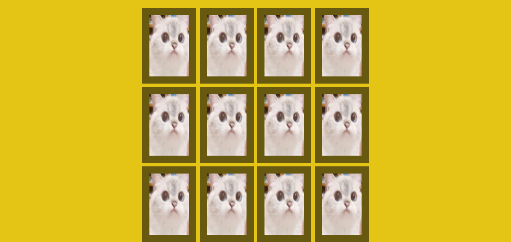
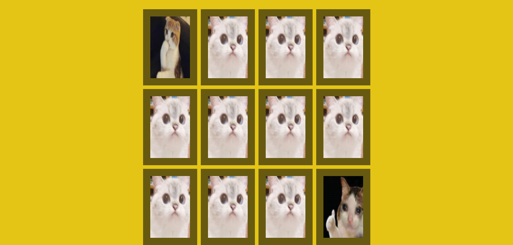
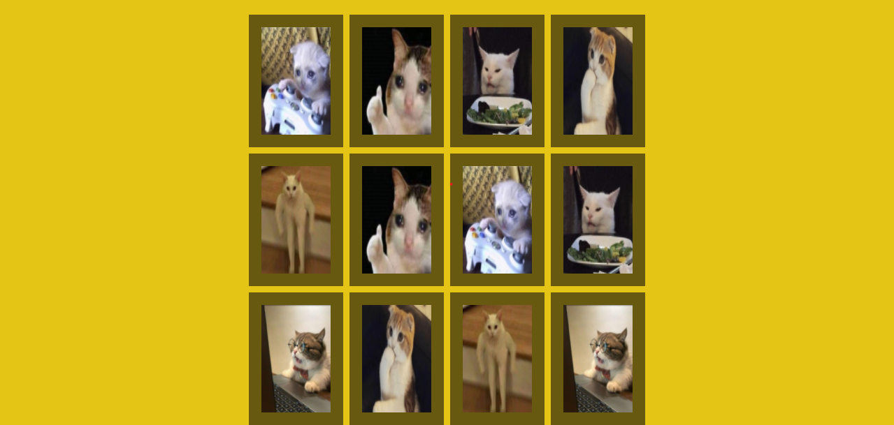

# Projects for Training


# Sobre o Repositório
Essa repositório é referente a alguns projetos que eu utilizo para aprender conceitos ou padrões de programação, seja por via de tutoriais, documentação ou mesmo algum outro repositório que eu considerar importante ou interessante.

## 1º projeto - Jogo da memória
### Sobre o projeto
Jogo da memória simples criado utilizando apenas CSS, HTML e Javascript, utilizei de base um tutorial do youtube, pois um diferencial que percebi deste projeto, é justamente a questão de que é dividido entre a lógica no Javascript e os estilos aplicados via CSS incluindo a alteração de classes via Javascript para alterar os efeitos nas cartas do jogo.

#### Tutorial de base para o projeto: https://www.youtube.com/watch?v=Rk4J-d7sPKQ

## Técnologias utilizadas
- HTML
- CSS
- Javascript

## Layout Web
  

# Como executar o projeto

### apenas 
```bash

# baixar projeto

# abrir o arquivo index.html no navegador
  
 ```
 
# Autor
William de Souza
  
https://www.linkedin.com/in/william-de-souza-040937194/
